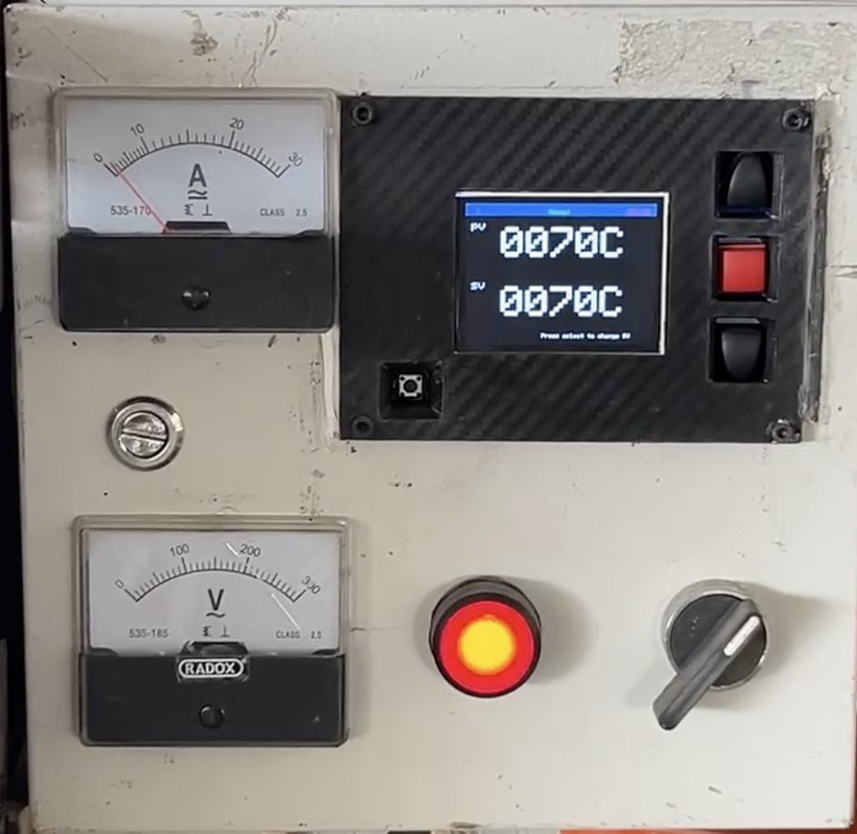
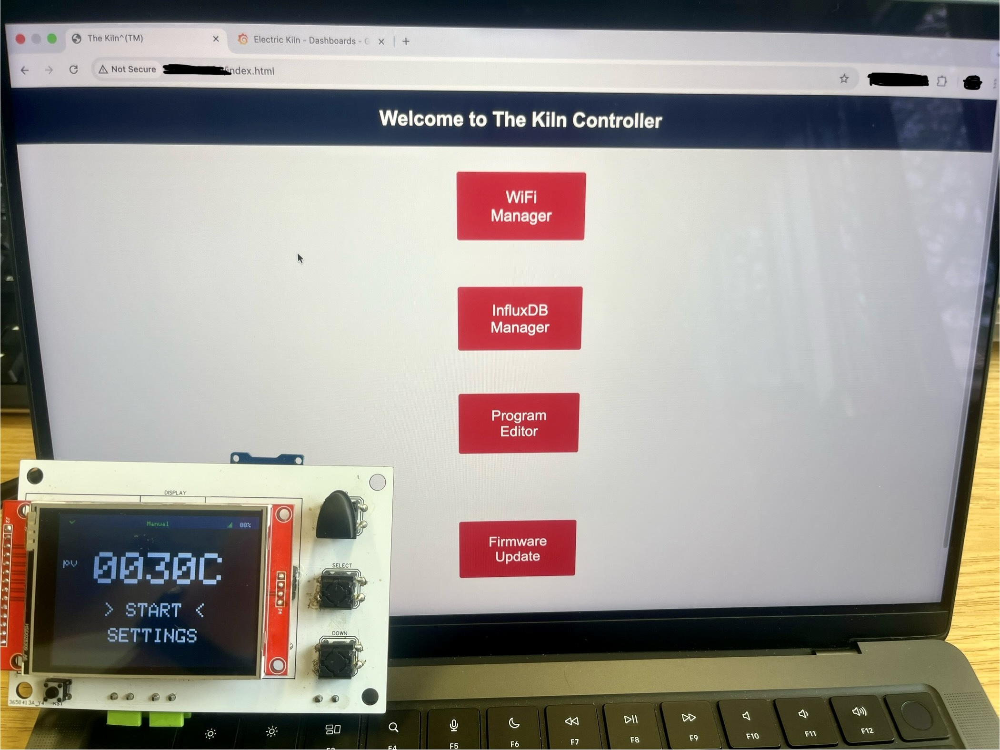
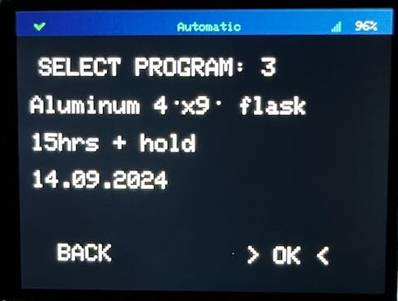
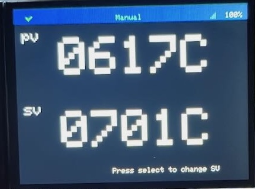

# ESP32 Electric Kiln Controller



This project is an open-source, DIY controller for electric kilns. It uses an ESP32 microcontroller to provide PID temperature control, a TFT display as an HMI, a web interface for creating and managing firing schedules and real-time data logging capability with InfluxDB and visualization in Grafana.

## Features

* **PID Temperature Control:** Accurate and stable temperature regulation for your kiln.
* **Multi-segment Firing Programs:** Create complex firing schedules with up to 20 segments, each with a target temperature, firing rate, and hold time.
* **Captive Portal Web Interface:** Configure WiFi, InfluxDB credentials, and firing programs through a web interface hosted directly on the ESP32 — no app required. Accessible at `http://192.168.4.1` when in AP mode.
* **InfluxDB Configuration via Web UI:** Enter and update your InfluxDB credentials (URL, API token, org, bucket, timezone) through the web interface. Credentials are saved to SPIFFS and survive reboots — no recompile needed.
* **Real-time Data Logging:** Pushes temperature data to InfluxDB for live monitoring and analysis in Grafana.
* **Safety Features:** Includes a door-mounted limit switch to shut down the kiln if the door is opened.
* **Simulation Mode:** Test firing programs without actually heating the kiln.
* **OTA Firmware Updates (untested):** Check for and install firmware updates directly from the web interface. Updates are pulled from GitHub Releases automatically when a new release is published.




## Hardware

See the Hardware [README](hardware/README.md) for details on how to setup the electrical connections and PCBs.

## Software and Installation

This project is built using [PlatformIO](https://platformio.org/).

### Prerequisites

* [Visual Studio Code](https://code.visualstudio.com/)
* [PlatformIO IDE Extension](https://platformio.org/platformio-ide)

### Dependencies

The following libraries are used in this project and will be installed automatically by PlatformIO:

* `bodmer/TFT_eSPI @^2.5.43`
* `wollewald/ADS1220_WE @ 1.0.15`
* `br3ttb/PID @ 1.2.1`
* `tobiasschuerg/ESP8266 Influxdb @ 3.13.1`
* `me-no-dev/AsyncTCP @ 1.1.1`
* `me-no-dev/ESPAsyncWebServer @ 1.2.4`
* `bblanchon/ArduinoJson @ 6.21.4`

### Simulation mode 

The controller has the capability to use First Order Plus Dead Time (FOPDT) model, see [sensor_task](lib/task/sensor_task.cpp) :: void readSimulatedTemp() for implemenation details.

At the moment one activates/deactivates via the following line in the [user setup](/src/userSetup.h):

```cpp
const bool SIMULATION = false;   
```
(future feature: toggle simulation mode via TFT screen or web config portal)

### Optional ADS1220 thermocouple amplifier
The ADS1220 thermocouple software and electronics design are based on the following article: [TI Precision Deisgns: Precision Thermocouple Measurement with the ADS1118](https://www.ti.com/lit/ug/slau509/slau509.pdf?ts=1700893585527&ref_url=https%253A%252F%252Fwww.google.com%252F)

The article is very informative and definetely worth a read to better understand how the Electric Kiln Controller reads temperatures using the ADS1220 ADC. 

For generating the necessary lookup tables I created a [python notebook](./TC%20table%20optimization/ThermocoupleCSV.ipynb) which uses the NIST ITS-90 Thermocouple Database. The generated lookup tables csv files are then uploaded to the `data/` folder which is then uploaded to ESP32's flash. The notebook is quite self explanatory, includes a testing section for validation and can be extended to generate more than the available (K, R, S) thermocouple tables by simply loading the respective NIST table.

### Installation Steps

1. **Clone the repository:**
   ```bash
   git clone https://github.com/pllagunos/ElectricKiln.git
   cd ElectricKiln
   ```

2. **Upload the filesystem:**
   * The web interface files are stored in the `/data` directory.
   * In PlatformIO, run the **"Upload Filesystem Image"** task. This uploads the HTML, CSS, and JavaScript files to the ESP32's SPIFFS partition.
   > **This step is required before first use.** The device cannot serve the web UI without it.

3. **Build and Upload:**
   * Connect your ESP32 to your computer.
   * In PlatformIO, click the **"Upload"** button (or run `pio run --target upload`).

## Configuration and Usage

The TFT display serves as the user interface together with the three push buttons next to it (Up, Select and Down).

The screen always shows a topbar with:
- Left corner: InfluxDB status: green checkmark = OK, red cross = FAIL.
- Center: Operating mode: Manual, Automatic.
- Right: Network status: OFFLINE, Connecting..., Signal Strength.

The main screen shows present temperature (PV), START and SETTINGS. The `> <` arrows shows which option is selected, to enter it one must click select.

**START SCREEN** shows preview of the program to load (or goes directly to running screen if in manual mode):



**RUN SCREEN** shows PV and SP


   - **Manual mode**: exit by clicking the UP button. Adjust setpoint by clicking select.
   - **Automatic mode**: exit by clicking the UP button while in the PV, SP screen. Navigate to tools screens with DOWN button.

**SETTINGS SCREEN** change firing mode, select program or enter config mode via captive portal.

### First Boot — WiFi Setup

By default the controller starts without AP mode and tries to connect to available networks. If it finds none, the controller will show an OFFLINE status in the top right corner.

To configure the WiFi network or add a new one:

1. Using the TFT display and navigation buttons go to: SETTINGS → CONFIG → START CAPTIVE PORTAL. The controller will start **Access Point (AP) mode**.
2. Connect your phone or computer to the WiFi network named **"The Kiln Controller"**.
3. A captive portal opens automatically. If it doesn't, navigate to `http://192.168.4.1`. 
4. Click **"WiFi Manager"** → scan for and select your home/studio network → enter the password → Submit.
5. When you are done configuring internal settings via the captive portal, click Exit at the bottom or > STOP CAPTIVE PORTAL < at the display.

### Creating Firing Programs

1. Open the captive portal or navigate to the device IP on your local network.
2. Click **"Program Editor"** to create and save firing programs.
3. Each segment defines a **target temperature**, **firing rate (°C/hr)**, and **hold time (min)**.

### InfluxDB Setup (Optional — for data logging)

InfluxDB credentials are configured entirely at runtime through the web UI — no recompile needed.

1. Open the captive portal (AP mode) or navigate to the device's IP address on your local network.
2. Click **"InfluxDB Manager"**.
3. Fill in:
   * **URL** — your InfluxDB instance, e.g. `https://us-east-1-1.aws.cloud2.influxdata.com`
   * **Token** — an API token with write access to your bucket
   * **Org** — your InfluxDB organization name or email
   * **Bucket** — the bucket to write data to
   * **Timezone** — POSIX tz string, e.g. `CST+6CDT,M4.1.0/2,M10.5.0/2`
4. Click **Save**. Credentials are stored in SPIFFS and survive reboots.

> **Note:** The API token is never sent back to the browser after saving — only the URL, org, bucket, and timezone are pre-filled when you revisit the form.

To set up InfluxDB Cloud and Grafana for visualization:
1. Sign up at [influxdata.com](https://www.influxdata.com/) and create a bucket.
2. Generate an API token with write access.
3. In Grafana, add InfluxDB as a data source and import the sample dashboard from `/grafana/dashboard.json`.

> **After importing the dashboard**, you'll need to update two things to match your setup:
> - **Datasource**: In each panel's query editor, switch the datasource to your own InfluxDB datasource.
> - **Bucket name**: The queries reference a bucket named `"Station of Analysis"` — update them to match whatever you named yours.
> - **Measurement name**: If you change the default data point name `"HORNO ELECTRICO"` (`/lib/task/database_task.cpp`) make sure to change this in the grafana data selector.

 
### OTA Firmware Updates (not tested)

The device can check for and install firmware updates directly from GitHub Releases — no USB cable needed after initial flashing.

**How it works:**
* When a new GitHub Release is published, the CI pipeline automatically builds the firmware, attaches `esp32doit-devkit-v1_firmware.bin` to the release, and appends the firmware's MD5 hash to the release notes.
* The device compares the current `OTA_VERSION` build flag against the release **tag** (e.g. `v1.0.1`).
* If a newer version is available, the "Update Now" button appears.
* Firmware integrity is verified with an MD5 hash fetched from the GitHub API before flashing.

**To check for updates:**
1. Make sure the device is connected to WiFi (not in AP mode).
2. Navigate to the device's IP address on your local network → **"Firmware Update"**.
3. Click **"Check for Update"**. The device queries `api.github.com`.
4. If an update is found, click **"Update Now"**. The device downloads, verifies, flashes, and restarts automatically (~60 seconds).
5. **Do not power off the device during an update.**

**To publish a new release (for developers):**
1. Go to the GitHub repo → Releases → "Draft a new release".
2. Create a tag (e.g. `v1.0.1`). The **Release title** can be anything — the device compares against the tag, not the title.
3. Click "Publish release". GitHub Actions will build and attach the firmware binary, and append the MD5 hash to the release notes automatically (takes ~2–3 minutes).

## Contributing

Contributions are welcome! Feel free to open an issue or submit a pull request.

## To Do
1. Web server doesn't start until restart after wifi credentials are set. Trigger restart or what to do?
2. MAX31856 capability + configure thermocouple from tft screen
3. Autotune PID ala https://github.com/hirschmann/pid-autotune/blob/master/autotune.py
4. advertising of project via forums/rdit/utube

## License

This project is licensed under the MIT License. See the `LICENSE` file for details.

ADD THE LICENSE