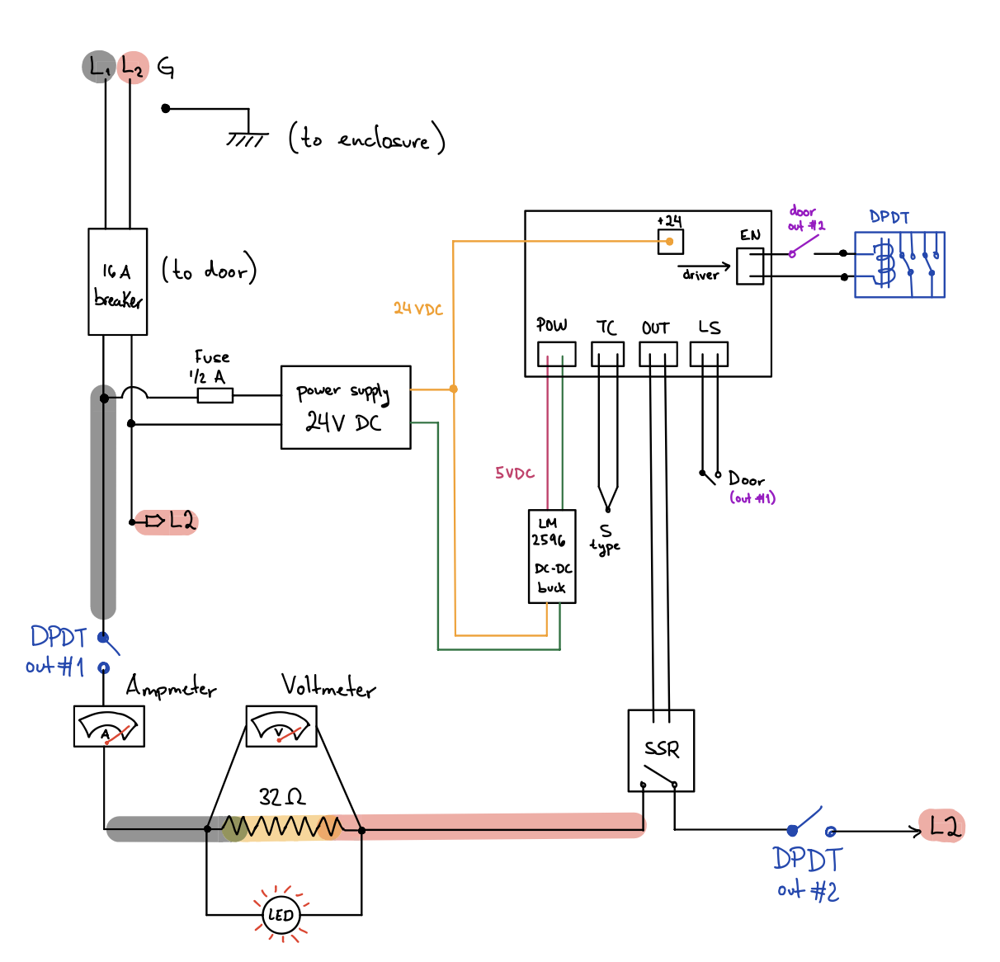
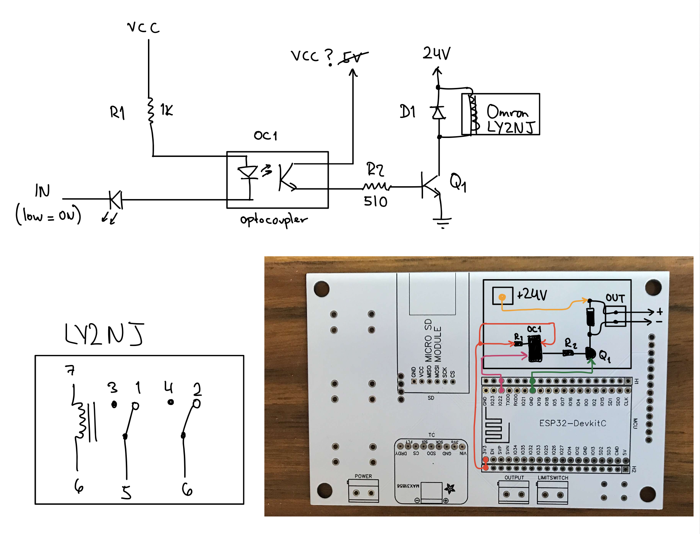
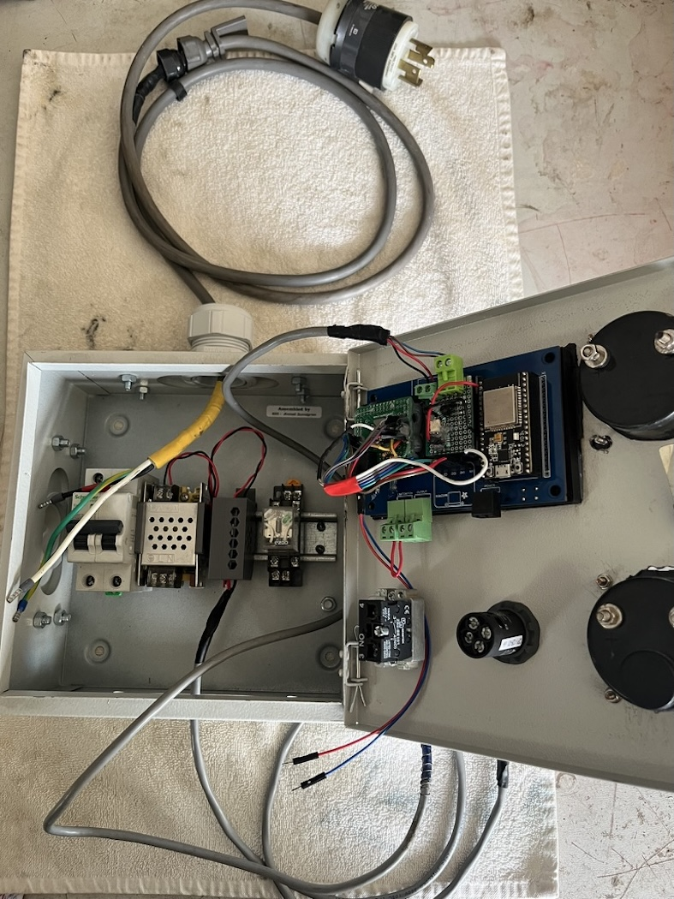

# Hardware Instructions

The controller is intended for electrical kilns which use resistive heating. Power is controlled via a solid state relay (SSR) energizing the heating coil for a percentage of a heating-cycle. Through the use of a DPDT relay we have a redundant safety power disconnect when the kiln door is opened.

Using the latest PCB and a two phase 220VAC system, a hardware connection of the controller to the kiln looks like this:
 

The electrical schematic can be adapter to one's system easily. However for safety related reasons one should always include: overcurrent protection, relay + SSR, door switch.
> **WARNING**: Wiring high voltage AC systems is a dangerous procedure if one is not familiar with mains power and safe practices. Always work with deenergized, disconnected systems. Use appropriate fuses/breakers and wires following local norms. The user is solely responsible for any damage or injury that may happen from inappropriate implementations.

## License

The hardware design files in this directory are licensed under the **CERN Open Hardware Licence Version 2 - Weakly Reciprocal**. See [`../LICENSE-HARDWARE`](../LICENSE-HARDWARE) for the full license text.

## Hardware Components

### Electronics

* **Microcontroller:** ESP32-DOIT-DEVKIT-V1 board
* **Thermocouple Amplifier:** MAX31856 thermocouple module board or an ADS1220 ADC converter.
* **Thermocouple:** Type-S Thermocouple (but configurable for B, K, R, N, E, J, and T types).
* **Solid State Relay (SSR):** To control the heating elements.
* **Main DPDT Relay:** Double pole double throw, disconnects main power.
* **TFT Display:** ILI9341 320x240 SPI display for the user interface (2.4 or 2.8 inch).
* **Buttons:** Three push buttons for on-device navigation (Up, Select, Down).
* **Limit Switch:** A safety switch for the kiln door.
* **Reset Button:** A reset button for the ESP32.

### PCB and Wiring

The PCB design files can be found in the `/hardware/PCB` directory. 

- `ADS1220 versions` is the current software supported version. The problem with this version is its missing some key details and I haven't done routing / manufacturing. The ESP32 pinout file is at [PINOUT.xlsx](PCB/ADS1220%20versions/PINOUT_HornoElectrico.xlsx).

- `MAX31856 versions` are older PCBs I designed when the project utilized a MAX31856 and an SD card. The ESP32 pinout file is at [PINOUT.xlsx](PCB/MAX31856%20versions/PINOUT_EliasKiln.xlsx). 

Currently I am using the MAX31856 version PCB with modifications that make it reassemble the ADS1220 PCB: 
* The MAX31856 SPI pins were rerouted to a small perfboard where I placed the ADS1220 in place. 
* The SD card module is not needed and I modified it to use the kiln DPDT with a relay driver as follows:

Since these modifications are custom and would be a lot of work for anybody, there are currently only two approaches to using this project:

1. Finish the ADS1220 PCB design and fabricate it, testing it works as expected.
2. Use the MAX31856 PCB design. Software needs added compatibility of MAX31856 library (easy). Hardware will need a hack to use the safety relay (easy, use any pin to drive relay board directly).

### Optional ADS1220 thermocouple amplifier
The ADS1220 thermocouple software and electronics design are based on the following article: [TI Precision Deisgns: Precision Thermocouple Measurement with the ADS1118](https://www.ti.com/lit/ug/slau509/slau509.pdf?ts=1700893585527&ref_url=https%253A%252F%252Fwww.google.com%252F)

The article is very informative and definetely worth a read to better understand how the Electric Kiln Controller reads temperatures using the ADS1220 ADC. 

For generating the necessary lookup tables I created a [python notebook](./TC%20table%20optimization/ThermocoupleCSV.ipynb) which uses the NIST ITS-90 Thermocouple Database. The generated lookup tables csv files are then uploaded to the `data/` folder which is then uploaded to ESP32's flash. The notebook is quite self explanatory, includes a testing section for validation and can be extended to generate more than the available (K, R, S) thermocouple tables by simply loading the respective NIST table.

### New PCB to-do list:

- [ ] Include 5V stepdown in board
- [ ] Do routing 
- [ ] Create gerber files
- [ ] Potentially use 24V system with chineseium PCB powersupplies
